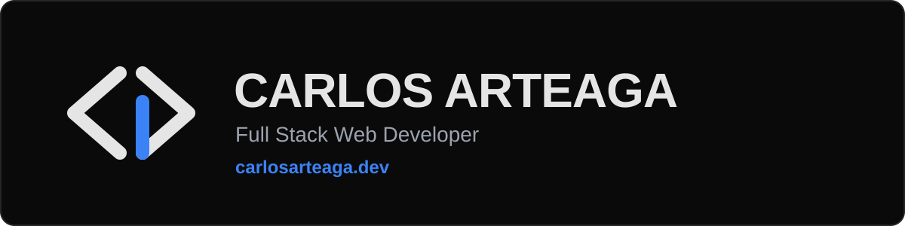

<div align="center">



<p>
  <a href="https://carlosarteaga.dev"></a>
  <a href="https://www.linkedin.com/in/carlos-daniel-arteaga"></a>
  <a href="mailto:carteagachamorro@gmail.com"></a>
</p>

<sub>🌐 Abre tu idioma abajo / Open your language below</sub>

</div>

<details open>
<summary><b>🇪🇸 Español</b></summary>

## 👋 Hola, soy Carlos

Soy desarrollador web **full stack** en Colombia 🇨🇴. Construyo interfaces rápidas con **React** y **Astro**, y las conecto con backends en **Node.js** y **PostgreSQL**. Vengo de la ingeniería biomédica, así que me encantan los proyectos donde el software resuelve problemas reales: salud, IoT y más. 🩺📡

> [!TIP]
> 🟢 **Disponible** para proyectos freelance y trabajo 100% remoto.

```js
const carlos = {
  rol: "Desarrollador web full stack",
  ubicacion: "Colombia 🇨🇴",
  stack: ["React", "Astro", "Node.js", "PostgreSQL"],
  aprendiendo: "Python 🐍",
  disponible: true, // ✨ freelance y trabajo remoto
};
```

## 🎯 Lo que hago

<table>
  <tr>
    <td align="center" width="33%"><h3>🎨</h3><b>Interfaces con carácter</b><br>React, Astro y Tailwind con animaciones que se sienten bien.</td>
    <td align="center" width="33%"><h3>⚡</h3><b>Velocidad real</b><br>Sitios rápidos y pensados para SEO desde el primer día.</td>
    <td align="center" width="33%"><h3>🔌</h3><b>Backend y datos</b><br>APIs con Node.js, bases de datos y todo bien conectado.</td>
  </tr>
</table>

## 🚀 Proyectos destacados

<table>
  <tr>
    <td width="50%" valign="top">
      <h3>🩺 Biomanage</h3>
      <p>SaaS full stack para gestionar equipos biomédicos: inventario, mantenimientos y métricas en tiempo real.</p>
      <p>
        
        
        
        
        
        
      </p>
      <p>🔒 En desarrollo, repositorio privado</p>
    </td>
    <td width="50%" valign="top">
      <h3>📡 Enlace Azul</h3>
      <p>Dashboard IoT para monitorear activos en tiempo real con tecnología BLE.</p>
      <p>
        
        
      </p>
      <p>🔗 <a href="https://iotenlaceazul.com/">Ver sitio</a></p>
    </td>
  </tr>
  <tr>
    <td width="50%" valign="top">
      <h3>🎵 El show debe continuar</h3>
      <p>Web-app gamificada para un lanzamiento musical, con desbloqueo progresivo de la historia.</p>
      <p>
        
        
        
        
      </p>
      <p>🔗 <a href="https://showdebecontinuar.com/">Ver sitio</a> &nbsp; 💻 <a href="https://github.com/carlos-daniel07/el-show-debe-continuar">Código</a></p>
    </td>
    <td width="50%" valign="top">
      <h3>🏢 The Master SAS</h3>
      <p>Sitio corporativo de alto rendimiento, pensado para SEO y Core Web Vitals.</p>
      <p>
        
        
        
      </p>
      <p>🔗 <a href="https://landing-page-themasters-sas-v1.netlify.app">Ver demo</a> &nbsp; 💻 <a href="https://github.com/carlos-daniel07/landing-the-master-sas">Código</a></p>
    </td>
  </tr>
  <tr>
    <td width="50%" valign="top">
      <h3>📶 Beacons IoT Technologies</h3>
      <p>Landing page para comercializar soluciones y servicios de IoT.</p>
      <p>
        
      </p>
      <p>🔗 <a href="https://www.beaconsiottechnologies.com/">Ver sitio</a></p>
    </td>
    <td width="50%" valign="top">
      <h3>✨ Y hay más…</h3>
      <p>Juegos con Canvas, apps del clima, componentes de UI y muchos experimentos de JavaScript.</p>
      <p>🔗 <a href="https://carlosarteaga.dev">Explora todo en carlosarteaga.dev</a></p>
    </td>
  </tr>
</table>

## 🛠️ Mi stack

**🎨 Frontend**<br>


**⚙️ Backend y datos**<br>


**🧰 Herramientas**<br>


## ⚡ Ahora mismo

- 🚧 Construyendo **Biomanage**, un SaaS para la gestión de equipos biomédicos.
- 🐍 Aprendiendo **Python** para backend, automatización y análisis de datos.
- 🤖 Integrando IA y herramientas de terminal en mi flujo de trabajo para automatizar lo repetitivo.
- 📱 Explorando el desarrollo de apps móviles.

## 📊 Lenguajes más usados


---

💬 ¿Tienes una idea o un proyecto en mente? **[Escríbeme](mailto:carteagachamorro@gmail.com)** y lo hablamos.

<sub>Hecho con 💙 y muchos `<div>`.</sub>

</details>

<details>
<summary><b>🇺🇸 English</b></summary>

## 👋 Hi, I'm Carlos

I'm a **full stack** web developer based in Colombia 🇨🇴. I build fast interfaces with **React** and **Astro** and connect them to backends in **Node.js** and **PostgreSQL**. I come from a biomedical engineering background, so I love projects where software solves real problems: healthcare, IoT and more. 🩺📡

> [!TIP]
> 🟢 **Available** for freelance projects and 100% remote work.

```js
const carlos = {
  role: "Full stack web developer",
  location: "Colombia 🇨🇴",
  stack: ["React", "Astro", "Node.js", "PostgreSQL"],
  learning: "Python 🐍",
  available: true, // ✨ freelance and remote work
};
```

## 🎯 What I do

<table>
  <tr>
    <td align="center" width="33%"><h3>🎨</h3><b>Interfaces with character</b><br>React, Astro and Tailwind with animations that feel right.</td>
    <td align="center" width="33%"><h3>⚡</h3><b>Real speed</b><br>Fast sites built with SEO in mind from day one.</td>
    <td align="center" width="33%"><h3>🔌</h3><b>Backend and data</b><br>APIs with Node.js, databases and everything well connected.</td>
  </tr>
</table>

## 🚀 Featured projects

<table>
  <tr>
    <td width="50%" valign="top">
      <h3>🩺 Biomanage</h3>
      <p>Full stack SaaS to manage biomedical equipment: inventory, maintenance scheduling and real-time metrics.</p>
      <p>
        
        
        
        
        
        
      </p>
      <p>🔒 In development, private repository</p>
    </td>
    <td width="50%" valign="top">
      <h3>📡 Enlace Azul</h3>
      <p>IoT dashboard to monitor assets in real time using BLE technology.</p>
      <p>
        
        
      </p>
      <p>🔗 <a href="https://iotenlaceazul.com/">Visit website</a></p>
    </td>
  </tr>
  <tr>
    <td width="50%" valign="top">
      <h3>🎵 El show debe continuar</h3>
      <p>Gamified web app for a music release, with progressive story unlocking.</p>
      <p>
        
        
        
        
      </p>
      <p>🔗 <a href="https://showdebecontinuar.com/">Visit website</a> &nbsp; 💻 <a href="https://github.com/carlos-daniel07/el-show-debe-continuar">Code</a></p>
    </td>
    <td width="50%" valign="top">
      <h3>🏢 The Master SAS</h3>
      <p>High-performance corporate website built for SEO and Core Web Vitals.</p>
      <p>
        
        
        
      </p>
      <p>🔗 <a href="https://landing-page-themasters-sas-v1.netlify.app">View demo</a> &nbsp; 💻 <a href="https://github.com/carlos-daniel07/landing-the-master-sas">Code</a></p>
    </td>
  </tr>
  <tr>
    <td width="50%" valign="top">
      <h3>📶 Beacons IoT Technologies</h3>
      <p>Landing page to promote IoT solutions and services.</p>
      <p>
        
      </p>
      <p>🔗 <a href="https://www.beaconsiottechnologies.com/">Visit website</a></p>
    </td>
    <td width="50%" valign="top">
      <h3>✨ And there's more…</h3>
      <p>Canvas games, weather apps, UI components and plenty of JavaScript experiments.</p>
      <p>🔗 <a href="https://carlosarteaga.dev">Explore everything at carlosarteaga.dev</a></p>
    </td>
  </tr>
</table>

## 🛠️ My stack

**🎨 Frontend**<br>


**⚙️ Backend and data**<br>


**🧰 Tools**<br>


## ⚡ Right now

- 🚧 Building **Biomanage**, a SaaS for biomedical equipment management.
- 🐍 Learning **Python** for backend work, automation and data analysis.
- 🤖 Bringing AI and terminal tools into my workflow to automate the repetitive parts.
- 📱 Exploring mobile app development.

## 📊 Most used languages


---

💬 Got an idea or a project in mind? **[Write to me](mailto:carteagachamorro@gmail.com)** and let's talk.

<sub>Made with 💙 and a lot of `<div>`s.</sub>

</details>
